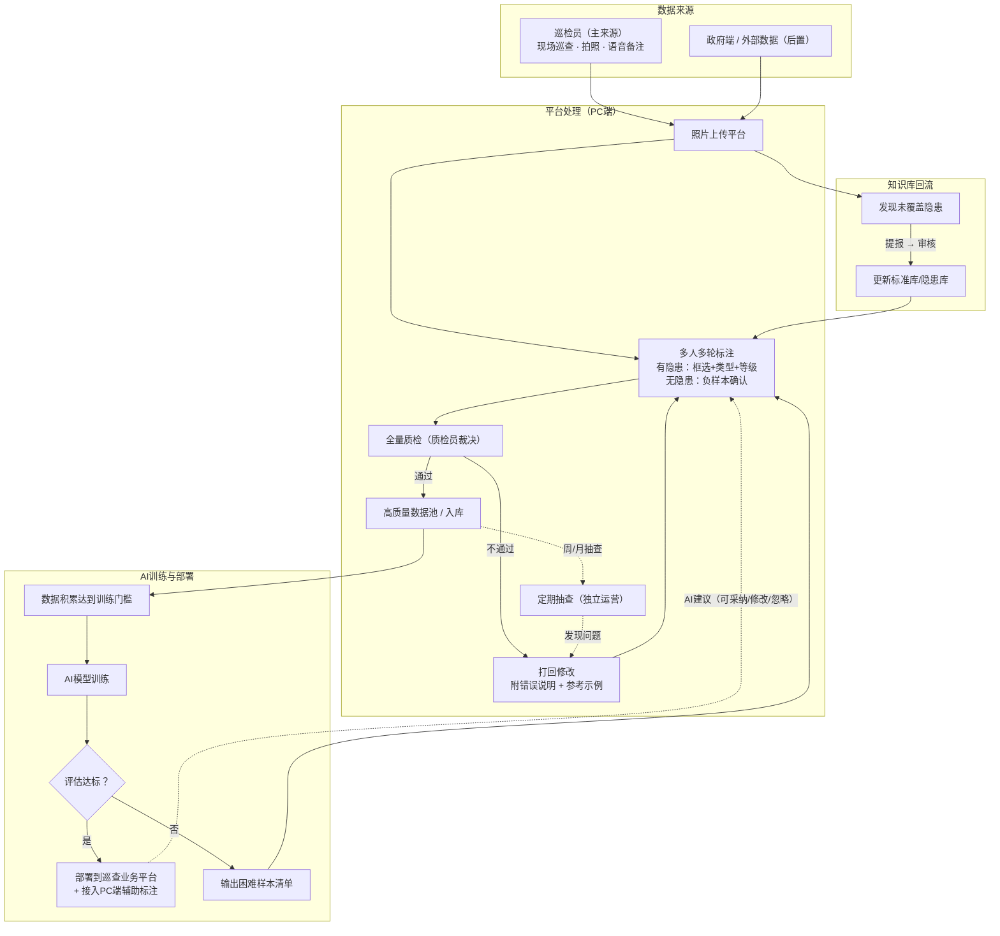

# 数据治理平台业务工作流程图

```mermaid
flowchart TD
    subgraph SRC ["数据来源"]
        A1["巡检员（主来源）<br/>现场巡查 · 拍照 · 语音备注"]
        A2["政府端 / 外部数据（后置）"]
    end

    A1 --> B["照片上传平台"]
    A2 --> B

    subgraph PLT ["平台处理（PC端）"]
        B --> E["多人多轮标注<br/>有隐患：框选+类型+等级<br/>无隐患：负样本确认"]
        E --> G["全量质检（质检员裁决）"]
        G -->|"通过"| H["高质量数据池 / 入库"]
        G -->|"不通过"| I["打回修改<br/>附错误说明 + 参考示例"]
        I --> E
        H -.->|"周/月抽查"| P["定期抽查（独立运营）"]
        P -.->|"发现问题"| I
    end

    H --> J

    subgraph AIT ["AI训练与部署"]
        J["数据积累达到训练门槛"] --> K["AI模型训练"]
        K --> L{评估达标？}
        L -->|"是"| M["部署到巡查业务平台<br/>+ 接入PC端辅助标注"]
        L -->|"否"| N["输出困难样本清单"]
        N --> E
        M -.->|"AI建议（可采纳/修改/忽略）"| E
    end

    subgraph LOOP ["知识库回流"]
        B --> U["发现未覆盖隐患"]
        U -->|"提报 → 审核"| X["更新标准库/隐患库"]
        X --> E
    end
```