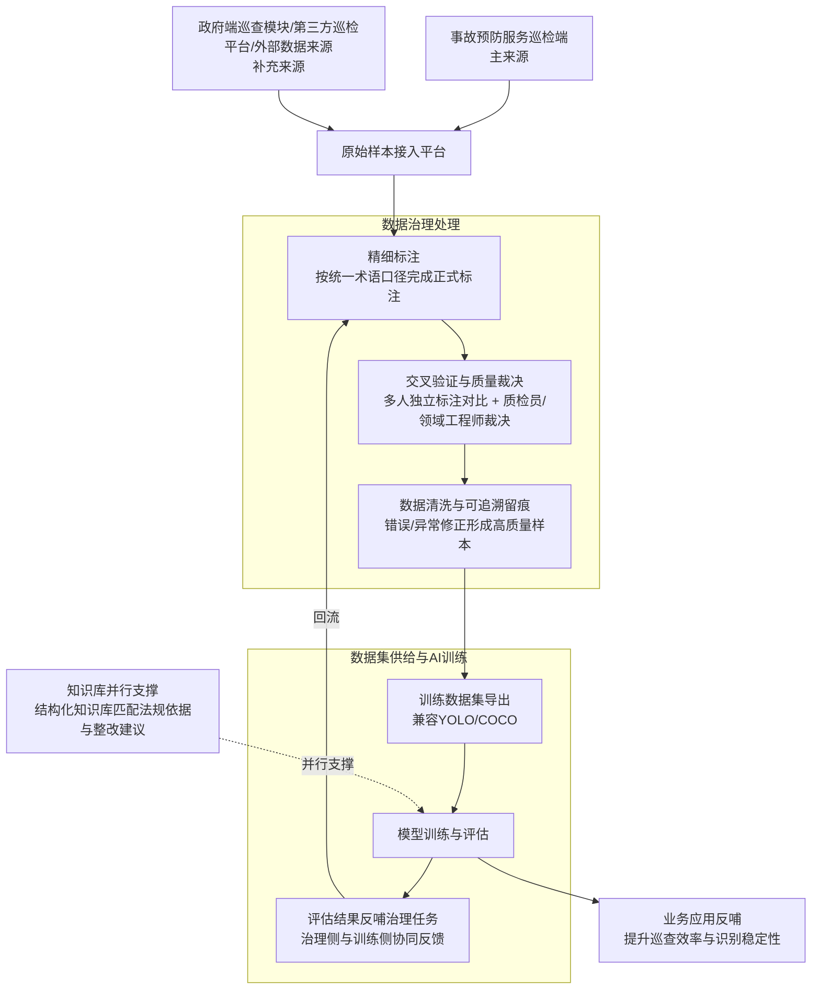

# 数据治理平台业务流程总览表-Mermaid

## 说明

- 本文档仅用于 Mermaid 渲染展示。
- 流程内容与 `数据治理平台业务流程总览表.md` 保持一致。
- 内容来源：`数据治理平台产品上下文.md`。

## Mermaid

## 更新记录

| 版本 | 日期 | 更新内容 |
|---|---|---|
| v1.0 | 2026-03-20 | 新建 Mermaid 独立文档，供流程可视化渲染使用 |
